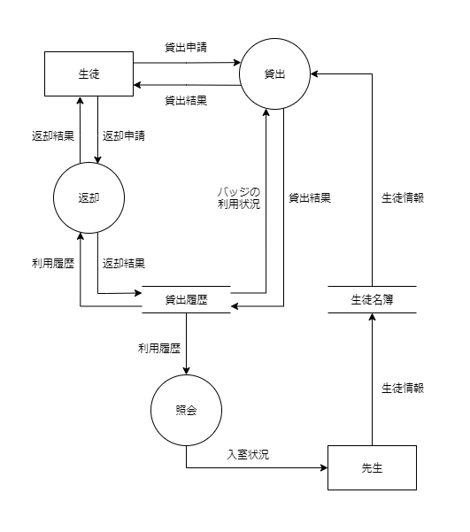

//
// 2021.12.24, Maqrona
//

=== 1.1. システムの要求

目的:: 既存のシステムの信頼性を高めつつ, 貸出や返却を速く行えるようにする.

目標:: 5 秒以内の貸出, 返却.

対象業務::
    * 実習室の入退室管理
    * バッジの貸出

対象ユーザ::
    * 情報技術科の先生
    * 実習室を使用する生徒

運用方針:: 情報技術科の *先生* が運用・管理する.

開発の工数とコスト:: 未定

=== 1.2. 実行環境

サーバ:: Ubuntu 20.04 LTS, Apache2, MySQL8, PHP5

クライアント:: Raspberry Pi 2, Pale Moon ブラウザ

バーコード形式:: CODE39

=== 1.3. データフロー

構築するシステムの近辺で発生するデータの流れについて可視化したものです. フローチャートのように「～する」といった「動作」が入ってはいけないことに注意！

==== 1.3.1. 凡例

.DFD の凡例
|===

| 記号 | 名前 | 意味

| 
| データフロー
| データの流れを表す

| 
| プロセス
| データの処理 (変換) を表す

| 
| データストア
| データの蓄積を表す

| 
| データの源泉, 吸収
| システム外部のデータ発生源もしくは行き先を表す

|===

.データディクショナリーの凡例

|===

| 記号 | 記述例 | 意味

| =
| 返却結果 = 利用履歴 + バッジ番号
| 左辺のデータは右辺のデータと同じ

| +
| 貸出申請 = ユーザ ID + 実習室 + 目的
| データ項目の結びつき (AND)

| [...]
| 申請結果 = [バッジ番号 \| 貸出NG]
| \| で区切って, いずれかの要素を表す (OR)

| {...}
| バッジの利用状況 = {バッジ番号 + 貸出済みか}
| 繰り返しを表す.

| (...)
| 入室状況 = 貸出結果 + (返却結果)
| あってもなくてもよい, 任意の要素を表す.

|===

TIP: データディクショナリーの記述はバッカス記法に準拠しています.

==== 1.3.2. レベル 0

コンテキストダイアグラムとも呼ばれるもので, 今回作成するシステムを 1 つのプロセスとしてデータフローを考えます.

.レベル 0 のデータディクショナリー
|===

| データフロー名 | 情報の内容

| 利用申請
| = ユーザ ID + 実習室 + 目的 + [入室 \| 退室]

| 入室状況
| = ユーザ ID + 学年 + クラス + 氏名 + 実習室 + 目的 + [入室時間 \| 退室時間] + 退出済みか

| 申請結果
| = [バッジ番号 \| 貸出NG]

|===

.DFD レベル 0
image::img/system_dfd/level0.png[]

[[dfd-level1-1-3-3]]
==== 1.3.3. レベル 1

システムを「貸出」「返却」「照会」に分割して, それぞれについてのデータフローを考えています.

.DFD レベル 1 のデータディクショナリー
|===

| データフロー名 | 情報の内容

| 貸出申請
| = ユーザ ID + 実習室 + 目的 + 貸出時間

| 貸出結果
| = 貸出申請 + 名前 + 貸出成功か

| 返却申請
| = ユーザ ID

| 返却結果
| = 貸出申請 + 名前 + 返却時間 + (利用時間) + 返却成功か

| 利用履歴
| = 貸出結果 + 返却結果

| バッジの利用状況
| = {バッジ番号 + 貸出済みか}

| 入室状況
| = 貸出結果 + (返却結果)

|===

.DFD レベル1

==== 1.3.4. レベル 2

「貸出」プロセスについて, 更に細分化したものです. 他のプロセスについてはこれ以上のデータ変換が発生しません.

.DFD レベル 2 のデータディクショナリー
|===

| データフロー名 | 情報の内容

| 照合結果
| = 貸出申請 + ユーザは存在するか

| バッジ番号
| = バッジ固有の番号

|===

TIP: 枠外のデータフローは <<dfd-level1-1-3-3, DFD レベル 1>> を参照してください.

.DFD レベル2 (貸出プロセス)
image::img/system_dfd/level2.png[]