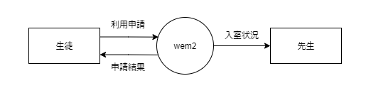

//
// 2021.12.24, Shogo Kitada
//

=== 1.1. システムの要求

目的:: 既存のシステムの信頼性を高めつつ, 貸出や返却を速く行えるようにする.

目標:: 5 秒以内の貸出, 返却.

対象業務::
    * 実習室の入退室管理
    * バッジの貸出

対象ユーザ::
    * 情報技術科の先生
    * 実習室を使用する生徒

運用方針:: 情報技術科の *先生* が運用・管理する.

開発の工数とコスト:: 未定

=== 1.2. 実行環境

サーバ:: Ubuntu 20.04 LTS, Apache2, MySQL8, PHP5

クライアント:: Raspberry Pi 2, Pale Moon ブラウザ

バーコード形式:: CODE39

=== 1.3. データフロー

.コンテキストダイアグラム (レベル 0)
