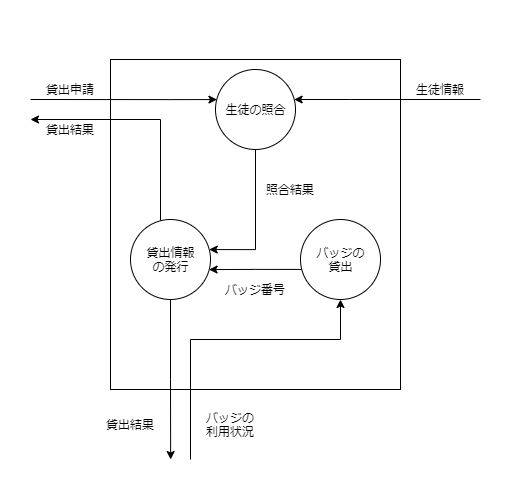

//
// 2021.12.24, Shogo Kitada
//

=== 1.1. システムの要求

目的:: 既存のシステムの信頼性を高めつつ, 貸出や返却を速く行えるようにする.

目標:: 5 秒以内の貸出, 返却.

対象業務::
    * 実習室の入退室管理
    * バッジの貸出

対象ユーザ::
    * 情報技術科の先生
    * 実習室を使用する生徒

運用方針:: 情報技術科の *先生* が運用・管理する.

開発の工数とコスト:: 未定

=== 1.2. 実行環境

サーバ:: Ubuntu 20.04 LTS, Apache2, MySQL8, PHP5

クライアント:: Raspberry Pi 2, Pale Moon ブラウザ

バーコード形式:: CODE39

=== 1.3. データフロー

==== 1.3.1. 凡例

TIP: データディクショナリーの記述はバッカス記法に準拠しています.

.データディクショナリーの凡例

|===

| 記号 | 記述例 | 意味

| =
| 返却結果 = 利用履歴 + バッジ番号
| 左辺のデータは右辺のデータと同じ

| +
| 貸出申請 = ユーザ ID + 実習室 + 目的
| データ項目の結びつき (AND)

| [...]
| 申請結果 = [バッジ番号 \| 貸出NG]
| \| で区切って, いずれかの要素を表す (OR)

| {...}
| 1{}3
| 繰り返しを表す. 外の右側の数字が繰り返しの数を表す. (省略可能)

| (...)
| ()
| あってもなくてもよい, 任意の要素を表す.

|===

==== 1.3.2. データフローの構造化表示

.レベル 0 のデータディクショナリー
|===

| データフロー名 | 情報の内容

| 利用申請
| = ユーザ ID + 実習室 + 目的 + [入室 \| 退室]

| 入室状況
| = ユーザ ID + 学年 + クラス + 氏名 + 実習室 + 目的 + [入室時間 \| 退室時間] + 退出済みか

| 申請結果
| = [バッジ番号 \| 貸出NG]

|===

.DFD レベル 0 (コンテキストダイアグラム)
image::img/system_dfd/level0.png[]

.DFD レベル 1 のデータディクショナリー
|===

| データフロー名 | 情報の内容

| 貸出申請
| = ユーザ ID + 実習室 + 目的 + 貸出時間

| 貸出結果
| = 貸出申請 + 名前 + 貸出成功か

| 返却申請
| = ユーザ ID

| 返却結果
| = 貸出申請 + 名前 + 返却時間 + 返却成功か

| 利用履歴
| = 貸出結果 + 返却結果

| バッジの利用状況
| = {バッジ番号 + 貸出済みか}

| 入室状況
| = 貸出結果

|===

.DFD レベル1
image::img/system_dfd/level1.png[]

.DFD レベル 2 のデータディクショナリー
|===

| データフロー名 | 情報の内容

| 照合結果
| = 貸出申請 + ユーザは存在するか

| バッジ番号
| = バッジ固有の番号

|===

TIP: 枠外のデータフローはレベル 1 を参照してください.

.DFD レベル2 (貸出プロセス)
